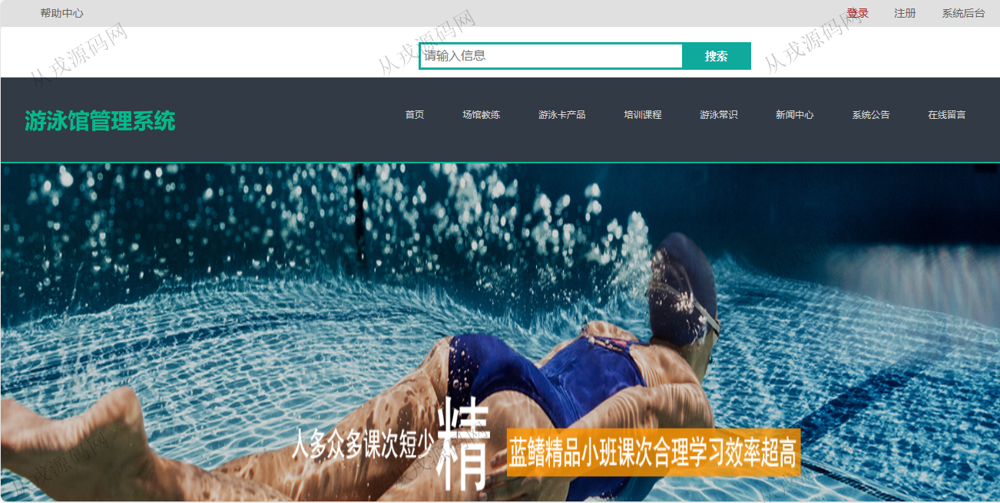
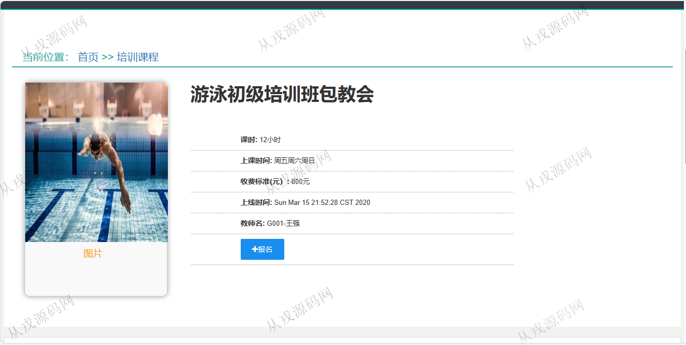

<h1 align="center">76.游泳馆管理系统</h1>

 获取sql文件 QQ: 386869957 QQ群: 377586148 

 [推荐站点: 从戎源码网](https://armycodes.com/) 

## 简介

> 本代码来源于网络,仅供学习参考使用!
>
> 提供1.远程部署/2.修改代码/3.设计文档指导/4.框架代码讲解等服务
> 
> 管理端登录地址：http://localhost:8080/swimming/admin/login.jsp
> 
> 管理员： admin admin
> 
> 用户端登录地址：http://localhost:8080/swimming/e/login.jsp
> 
> 用户：user 1
>

## 项目介绍
基于ssm的游泳馆管理系统：前端jsp、jquery、bootstrap，后端 springmvc、spring、mybatis，集成游泳课程报名、游泳卡在线售卖、购物车、在线付款、商品发布、订单管理等功能于一体的系统。

## 功能介绍

### 用户

- 基本功能：登录、注册、退出
- 首页：全局搜索，主导航栏目，轮播图，新闻公告列表，会员卡列表展示，游泳常识列表
- 场馆教练：教练信息列表，教练详情介绍
- 游泳卡产品：月卡，季卡，半年卡，季卡，游泳卡详情介绍，游泳卡收藏，游泳卡购买，购物车，提交订单，付款
- 培训课程：培训课程列表，培训课程详情，在线报名
- 游泳常识：常识文章展示，赞，踩，关注
- 新闻中心：新闻列表，新闻详情
- 系统公告：公告列表，公告详情
- 在线留言：留言查看，留言发布
- 我的订单：订单列表，取消，付款，查看订单详情
- 我的培训课程：我报名的课程列表，付款，查看课程
- 我的收藏：收藏的游泳卡列表，收藏的课程列表，收藏删除
- 安全中心：登录密码修改，支付密码修改，录入密保问题，我的密保问题
- 账户信息：账户信息查看，收货地址添加和维护，账户余额，充值，个人信息修改

### 管理员

- 培训课程管理：关键词搜索，课程信息的增删改查
- 网站资讯管理：资讯信息的增删改查，条件搜索查询
- 栏目管理：栏目信息的增删改查
- 系统公告管理：公告信息的增删改查
- 商品管理：商品信息是增删改查，上架，下架操作，补充库存
- 商品列表管理：类别信息的增删改查
- 订单管理：订单列表，订单删除，订单发货，订单查看
- 培训对象：培训对象的增删改查
- 销售统计：时间区间范围内的销售统计信息展示
- 用户管理：会员管理，后台用户管理，密码修改
- 系统设置：首页轮播图管理，网站导航设置，首页栏目设置，系统介绍设置

## 环境

- <b>IntelliJ IDEA 2021.3</b>

- <b>Mysql 5.7.26</b>

- <b>Tomcat 7.0.73</b>

- <b>JDK 1.8</b>

## 运行截图

